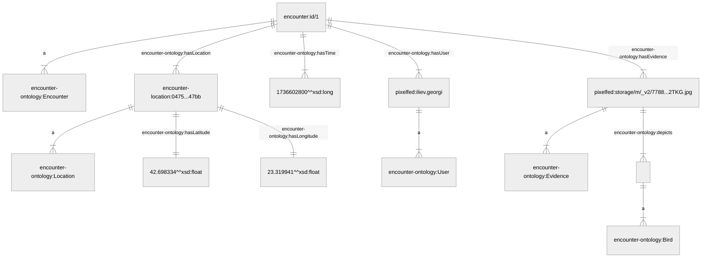
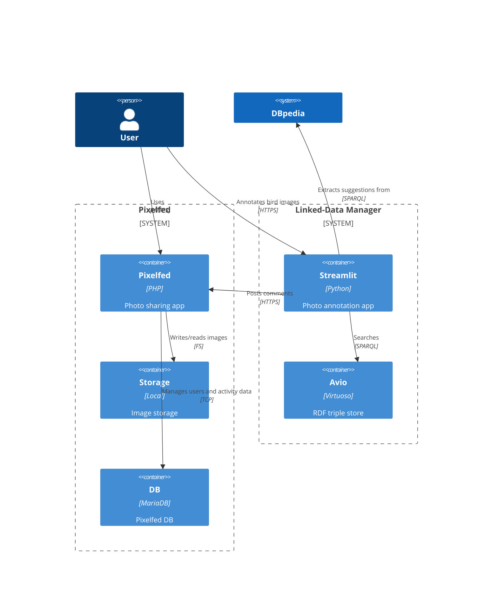
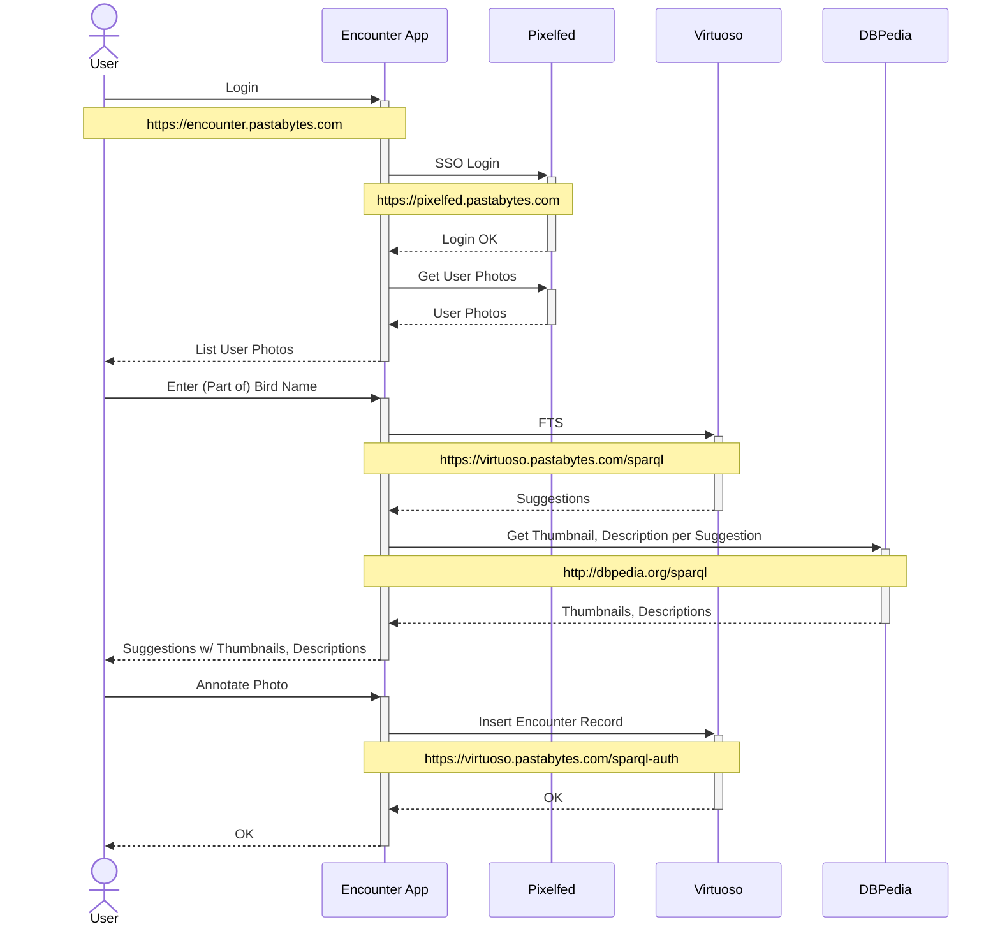

# Encounter


## Vision

The aim of this project is to build a live knowledge graph of manually curated data points describing human-bird encounters. The data is made available via a standard endpoint to explore and embed into downstream applications.


## The lingo

Throughout the code and the enabling materials we work with the following central concepts

- __Encounter__
  
  The physical act of observing an object of interest (e.g. a bird) in the real world. It is grounded in place and time and has some additional properties helping systems handle the encounter's digital representation effectively

- __Evidence__

  The digital evidence documenting an encounter. This could be a photograph, a log book entry, or any other material referring to the encounter taking place. Evidence is collected and managed in an external system (e.g. a social network with photo sharing capability)

-  __Knowledge graph__

   The collection of integrated data points linking formal encounter representations to the evidence from an external system and to entries from a specialized information system (e.g. an ontology for managing the scientific and common names of birds)


## Semantic model

### Namespaces
```
@prefix encounter: <https://encounter.pastabytes.com/v0.1.0/> .
@prefix encounter-location: <https://encounter.pastabytes.com/v0.1.0/location/> .
@prefix encounter-ontology: <https://encounter.pastabytes.com/v0.1.0/ontology/> .
@prefix pixelfed: <https://pixelfed.pastabytes.com/> .
```

### As-built `Encounter` model

### Colour legend

 Encounter instance data element

 Encounter ontology element

 Pixelfed resource


 [AVIO - Ontology of the birds of the world](http://onki.fi/en/browser/search?&os=avio&c=avio+avio_juuri) resource

 typed literal value


## Solution architecture




## Annotate workflow




## Usage

The instructions below apply to the public experimental environment. For local development and experimentation point your browser to the respective local addresses.

### Onboarding new citizen ornithologist users
1. Navigate to the [photo sharing app homepage](https://pixelfed.pastabytes.com)
2. Sign up as a new user. Make sure you provide a valid email address. Confirm your email address by clicking the button in the email confirmation message you receive
3. Clicking the confirmation button will take you back to the [photo sharing app](https://pixelfed.pastabytes.com) where you can post your first picture

### Annotating evidence
1. Navigate to the [photo annotation app homepage](https://encounter.pastabytes.com)
2. Click the `Login` button. Since the photo sharing app provides the SSO functionality, if prompted for a user name and password, log in as the user you created in the onboarding step
3. Switch to the `Annotate` option. Use the UI controls to add the necessary encounter information to each evidence:
    - from the `Pin location` tab pick the location of the encounter on the world map
    - from the `Search species` tab search for the bird you encountered using either English, Latin, Swedish or Finnish
    - click the button corresponding to your selected species to finish annotating the evidence
    - you can repeat the process also for existing annotations if adjustments/corrections are needed
    - you can delete existing annotations from the `Delete encounter` tab

### Consuming data from the knowledge graph
1. Switch to the `Explore` option. Use the UI controls to browse and inspect encounter data from the knowledge graph plotted on the world map
2. Navigate to the [semantic repository SPARQL console](https://virtuoso.pastabytes.com/sparql). This is a publicly available read-only SPARQL endpoint
3. Query the data already collected via SPARQL. See example below building the graph for a single encounter

    ````sparql
    PREFIX encounter-ontology: <https://encounter.pastabytes.com/v0.1.0/ontology/>

            CONSTRUCT 
            WHERE {
                GRAPH <https://encounter.pastabytes.com> {
                    ?encounter_id a encounter-ontology:Encounter ;
                        encounter-ontology:hasLocation ?encounter_location_id ;
                        encounter-ontology:hasTime ?encounter_time ;
                        encounter-ontology:hasUser ?encounter_user ;
                        encounter-ontology:hasEvidence ?encounter_evidence .

                    ?encounter_location_id a encounter-ontology:Location ;
                        encounter-ontology:hasLatitude ?encounter_location_latitude ;
                        encounter-ontology:hasLongitude ?encounter_location_longitude .

                    ?encounter_user a encounter-ontology:User .

                    ?encounter_evidence a encounter-ontology:Evidence ;
                        encounter-ontology:depicts ?encounter_species .
                    
                    ?encounter_species a encounter-ontology:Bird .
                }
            } LIMIT 1
    ````
  4. Integrate graph data programmatically via the same read-only SPARQL endpoint into your own application

## Contributing to the project

### Roles

Contributions are invited from

- alpha testers (citizen ornithologists)
- interest group representatives and advocates to help shape a product roadmap and drive adoption across their communities
- semantic engineers
- community developers and devops engineers
- anyone who finds the topic worth their while

### Collaborating on the shared code base

To enable effective collaboration and have fun while working on the project, the following basic rules apply

#### Trunk-based development

Feature branches and bugfixes created off the latest main branch. PRs submitted into the main branch for peer review. PR descriptions on GitHub to refer to the work item being adressed using one of the keywords triggering movement on the project board, e.g. `Closes #42`.

#### Branch naming convention

No branch without a clear link to a corresponding work item. Branch names to start with the GitHub project work item number followed by a `/` and a short lowercase descriptive name with hyphens `-` used as separators, e.g. `42/add-readme`.

#### Commit history

Squashes and history rewrites to take place in the local branch ahead of opening a PR. No commit history rewrites in the main branch. Clean commit messages following the principles outlined in https://cbea.ms/git-commit/.

#### Exchanging secrets

If at any point collaborators need to exchange a secret such as API client credentials, user passwords etc. over a public channel, this to be done exclusively using appropriate GPG encryption or a dedicated secrets manager with sharing capability such as [Keeper](https://keepersecurity.eu). No secrets to be committed at any point in git.

Secrets exchanged otherwise to be considered compromised and invalidated as soon as possible.

#### Setting up a local dev environment

For details on how to spin up a fully-fledged system locally see this [write-up](https://iliev-georgi.github.io/pastabytes/the-quick-and-dirty/). You could also modify the docker compose script and configuration to make it work for your local setup.

## Contacts

Contributors and anyone intereseted in the topic please contact me at watcher@pastabytes.com.